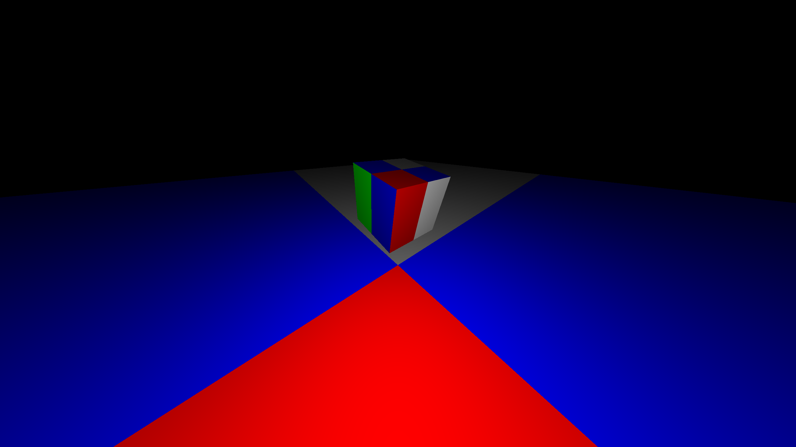

Quake/UT/GoldSrc-style renderer but with angle-darkening instead of lighting to help differentiate objects in 3D space based on depth

# Usage

1) Create native window with OpenGL context (e.g. with [GWindower](https://github.com/GeeTwentyFive/libGWindower) or GLFW)
2) `GRenderer gr3d;`
3) ...create meshes, instantiate created meshes...
4) `gr3d.DrawFrame(FRAMEBUFFER_WIDTH, FRAMEBUFFER_HEIGHT);` (+ do a `glClear(GL_COLOR_BUFFER_BIT | GL_DEPTH_BUFFER_BIT)` each frame (lib doesn't do that so that you can compose it with other rendering))

# API

- `.camera_pos` - Set/Get camera position
- `.camera_yaw` - Set/Get camera horizontal (left<->right) rotation
- `.camera_pitch` - Set/Get camera vertical (up<->down) rotation
- `.camera_fov` - Set/Get camera Field of View
- `.CreateMesh()` - Write mesh to GPU
- `.AddMesh()` - Create instance of mesh created with `.CreateMesh()`
- ##### AT END OF FRAME: `.DrawFrame()`  (returns 0 on success, source line number on error)

#

#### MeshInstance (created with `.AddMesh()`):
- `.position` - Set/Get position
- `.rotation` - Set/Get rotation (Quaternion)
- `.scale` - Set/Get scale
- `.color_RGBA` - Set/Get color shift (in RGBA; 0xRRGGBBAA)
- `.Remove()` - Remove from existence.